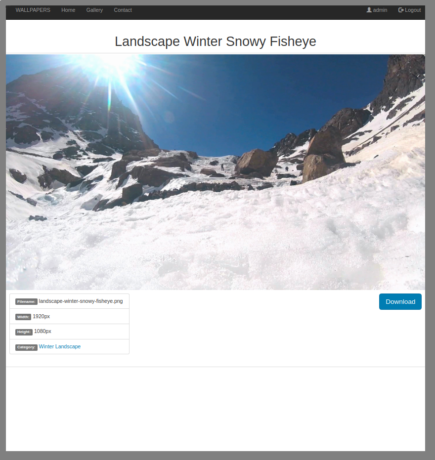
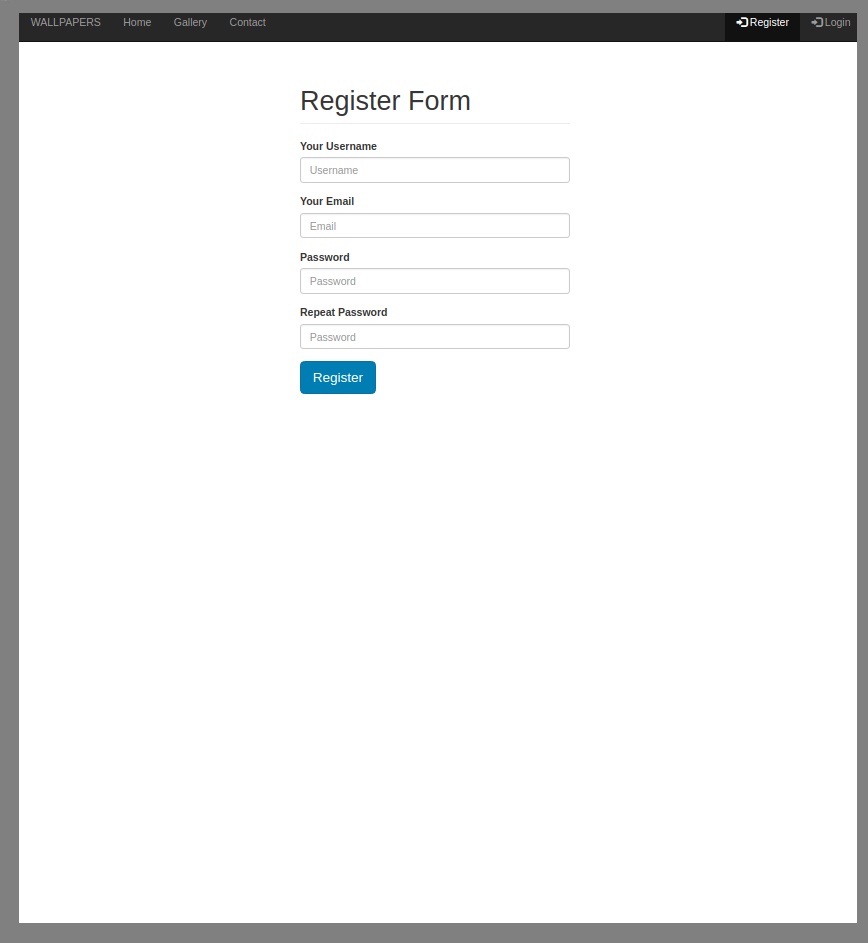

# Wallpaper Website - Symfony 4 Flex App
## View Demo N\A
1. In this tutorial app I am going to takes a hands-on approach to building a Wallpaper / Desktop Background sharing website:
2. To begin with in this app I'm going to make use of the following skills and technologies:
    * Controllers, Routing, Twig
    * Login Form
    * Register Form
    * Contact Form
    * Pagination on gallery page
    * Doctrine queries (DQL), results, entity repositories
    * Doctrine data load fixtures
    * Creating console commands as alternative to load image data in our DB from `public/image`
    * Form Type, file uploads, and form theming
    * EasyAdminBundle
    * Event Listeners, Doctrine lifecycle hooks
    * Symfony Services
    * Test Driven Development techniques (PhpSpec)
    * Bootstrap 3

## Install
Run `composer install` in your root directory.

## App Env Vars, DATABASE Config, Load Demo Data Fixtures
1. Rename `.env.dist` to `.env`:
    * Set your `DATABASE_URL` and db `SERVER_VERSION` to config doctrine/doctrine-bundle,
    * `MAILER_URL` to config symfony/swiftmailer-bundle for contact form,
    * `ADMIN_EMAIL` email to which you will receive messages from the contact form on site;
2. Run `php bin/console doctrine:database:create` to create new database by credentials from .env file.
3. Run `php bin/console doctrine:migrations:migrate` to run migration process and build database schema according to our doctrine entities.
4. Run `php bin/console doctrine:fixtures:load` to load demo data fixtures (category, wallpapers images), insert rows in your DB, etc.
5. Admin User is login `admin`, password `1111`

## Development server
Run `composer start` or `php bin/console server:start` for start a dev server. Navigate to `http://localhost:8000/`.
Run `composer stop` or `php bin/console server:stop` for stop a dev server.

## Running phpspec tests
Run `composer test` or `php vendor/bin/phpspec run` to execute the phpspec tests via ["phpspec/phpspec": "^4.3"](http://www.phpspec.net).
Phpspec test are located in `./spec` folder.

## Further help
To get more help use my email `maksimgru@gmail.com` or my skype `maksgru` or got to my website [www.m-dev.net](http://www.m-dev.net)

## Screenshots

